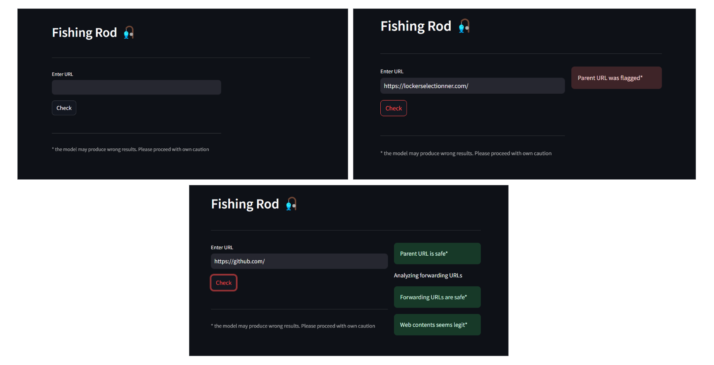

# 🎣 FishingRod - Phishing Website Detection Tool
FishingRod is a powerful tool designed to detect phishing websites using a multi-layered approach. By leveraging VirusTotal API, analyzing internal URLs, and incorporating Machine Learning models, FishingRod provides accurate and reliable phishing detection to protect users from potential cyber threats.



## 🚀 Features
**VirusTotal Integration**: Matches website data against VirusTotal's database via API for phishing detection.
**URL Analysis**: Scans all internal URLs on a website for potential phishing threats.
**Machine Learning Model**: Analyzes web content using a trained machine learning model to identify phishing websites that might bypass the VirusTotal API.
**Multi-Layered Detection**: Combines API-based and ML-based techniques for robust phishing detection.

## 📦 Usage
1. Clone the repository:
```bash
git clone https://github.com/satwikkaushik/FishingRod.git
cd FishingRod
```

2. Install the dependencies
3. Set up your VirusTotal API key by obtaining an API key from VirusTotal.
4. Run using below command
```bash
streamlit run app.py
```

## 📖 Working
**VirusTotal API Check:**
- The website's URL is queried in the VirusTotal database.
- The API flags websites already identified as phishing.

**Internal URL Analysis:**
- All URLs within the website are extracted and checked against VirusTotal.

**Machine Learning Classification:**
- Any website not flagged by VirusTotal are further analyzed by a trained machine learning model.
- The model inspects web content features to classify potential phishing threats.

**Streamlit UI:**
- The interactive UI simplifies the workflow, making it accessible to users without technical expertise.

## 🛡️ Disclaimer
FishingRod is intended for educational and research purposes only.

